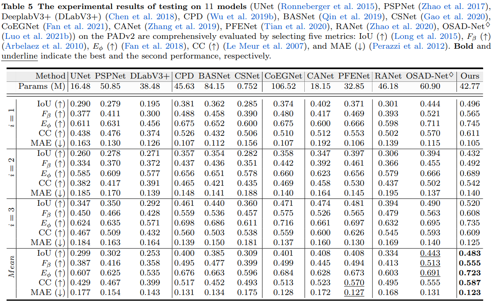

# One-shot Affordance Detection
In this repo, we provide the pytorch code for the two papers:

<p align="center">
  <a href="#Paper-Link">:link: Paper Link</a> |
  <a href="#Abstract">:bulb: Abstract</a> |
  <a href="#Pipeline">:book: Pipeline</a> |
  <a href="#Dataset">:open_file_folder: Dataset</a> |
  <a href="#Requirements">:clipboard: Requirements</a> |
  <a href="#Usage">:pencil2: Usage</a> |
  <a href="#Results">:bar_chart: Results</a> |
  <a href="#Citation">:mag: Citation</a>
</p>

## :link: Paper Link
* One-Shot Affordance Detection (IJCAI2021) ([link](https://arxiv.org/abs/2106.14747))
> Authors:
> Hongchen Luo, Wei Zhai, Jing Zhang, Yang Cao, Dacheng Tao
* One-Shot Affordance Detection (Journal Version) ([link]())
> Authors:
> Wei Zhai*, Hongchen Luo*, Jing Zhang, Yang Cao, Dacheng Tao

## :bulb: Abstract
Affordance detection refers to identifying the potential action possibilities of objects in an image, which is a crucial ability for robot perception and manipulation. To empower robots with this ability in unseen scenarios, we first consider the challenging one-shot affordance detection problem in this paper, i.e., given a support image that depicts the action purpose, all objects in a scene with the common affordance should be detected. To this end, we devise a One-Shot Affordance Detection Network (OSAD-Net) that firstly estimates the human action purpose and then transfers it to help detect the common affordance from all candidate images. Through collaboration learning, OSAD-Net can capture the common characteristics between objects having the same underlying affordance and learn a good adaptation capability for perceiving unseen affordances.  Besides, we build a Purpose-driven Affordance Dataset v2 (PADv2) by collecting and labeling 30k images from 39 affordance and 94 object categories. With complex scenes and rich annotations, our PADv2 can comprehensively understand the affordance of objects and can even be used in other vision tasks, such as scene understanding, action recognition,  robot manipulation, etc. We present a standard one-shot affordance detection benchmark comparing 11 advanced models in several different fields. Experimental results demonstrate the superiority of our model over previous representative ones in terms of both objective metrics and visual quality.

## :book: Pipeline
### 1. OSAD-Net (IJCAI2021)
<p align="center">
     <br />
    <em> 
    </em>
</p>

**Our One-Shot Affordance Detection (OS-AD) network.** OSAD-Net_ijcai consists of three key modules: Purpose Learning Module (PLM), Purpose Transfer Module (PTM), and Collaboration Enhancement Module (CEM). (a) PLM aims to estimate action purpose from the human-object interaction in the support image. (b) PTM transfers the action purpose to the query images via an attention mechanism to enhance the relevant features. (c) CEM captures the intrinsic characteristics between objects having the common affordance to learn a better affordance perceiving ability.

### 2. OSAD-Net (Journal Version)
<p align="center">
     <br />
    <em> 
    </em>
</p>

**The framework of our OSAD-Net.** For our OSAD-Net pipeline, the network first uses a Resnet50 to extract the features of support image and query images. Subsequently, the support feature, the bounding box of the person and object, and the pose of the person are fed together into the action purpose learning (APL) module to obtain the human action purpose features. And then send the human action purpose features and query images together to the mixture purpose transfer (MPT) to transfer the human action purpose to query images and activate the object region belonging to the affordance in the query images. Then, the output of the MPT is fed into a densely collaborative enhancement (DCE) module to learn the commonality among objects of the same affordance and suppress the irrelevant background regions using the cooperative strategy, and finally feed into the decoder to obtain the final detection results.

## :open_file_folder: Dataset
<p align="center">
     <br />
    <em> 
    </em>
</p>

**The samples images in the PADv2 of this paper.** Our PADv2 has rich annotations such as affordance masks as well as depth information. Thus it provides a solid foundation for the affordance detection task. 

<p align="center">
     <br />
    <em> 
    </em>
</p>

**The properties of PADv2.** (a) The classification structure of the PADv2 in this paper consists of 39 affordance categories and 94 object categories. (b) The word cloud distribution of the PADv2. (c) Overlapping masks visualization of PADv2 mixed with specific affordance classes and overall category masks. (d) Confusion matrix of PADv2 affordance category and object category, where the horizontal axis corresponds to the object category and the vertical axis corresponds to the affordance category, (e) Distribution of co-occurring attributes of the PADv2, the grid is numbered for the total number of images.

### Download Data
- You can download the PAD from [Baidu Pan](https://pan.baidu.com/s/11lEf4Y05jES2ntb4aS8QaQ) (z40m)

```bash  
cd Downloads/
unzip PAD.zip
cd OSAD-Net
mkdir datasets/PAD
mv Downloads/PAD/divide_1 datasets/PAD/   
mv Downloads/PAD/divide_2 datasets/PAD/   
mv Downloads/PAD/divide_3 datasets/PAD/  
```

- You can download the PADv2 from [Baidu Pan](https://pan.baidu.com/s/1K_6I3JjamkEcdh19dXOYVg) (gz61)
```bash  
cd Downloads/
unzip PADv2_part1.zip
cd OSAD-Net
mkdir datasets/PADv2_part1
mv Downloads/PADv2_part1/divide_1 datasets/PADv2_part1/  
mv Downloads/PADv2_part1/divide_2 datasets/PADv2_part1/  
mv Downloads/PADv2_part1/divide_3 datasets/PADv2_part1/   
```

## :clipboard: Requirements
  - python 3.7 
  - pytorch 1.1.0
  - opencv

## :pencil2: Usage

To get our project:
```bash  
git clone https://github.com/lhc1224/OSAD_Net.git
cd OSAD-Net
```
### Train
You can download the pretrained model from [Baidu Pan](https://pan.baidu.com/s/1HbsvNctWd6XLXFcbIoq1ZQ) (xjk5),then move it to the `models` folder
To train the OSAD-Net_ijcai model, run `run_os_ad.py` with the desired model architecture:
```bash  
python run_os_ad.py   
```

To train the OSAD-Net model, run `run_os_adv2.py` with the desired model architecture:
```bash  
python run_os_adv2.py   
```

### Test
To test the OSAD-Net_ijcai model, run `run_os_ad.py`:
```bash  
python run_os_ad.py  --mode test 
```
To test the OSAD-Net model, run `run_os_ad.py`:
```bash  
python run_os_adv2.py  --mode test 
```
### Evaluation
In order to evaluate the forecast results, the evaluation code can be obtained via the following [link](https://github.com/lhc1224/OSAD_Net/tree/main/PyMetrics).

## :bar_chart: Experimental Results
### Performance on PADv2
You can download the affordance maps from [Baidu Pan](https://pan.baidu.com/s/1af_WJo30m1PO1JOI9S1k_g) (hwtf)
<p align="center">
     <br />
    <em> 
    </em>
</p>

### Performance on PAD
You can download the affordance maps from [Baidu Pan]()
<p align="center">
     <br />
    <em> 
    </em>
</p>


## :mag: Citation

```
@inproceedings{Oneluo,
  title={One-Shot Affordance Detection},
  author={Hongchen Luo and Wei Zhai and Jing Zhang and Yang Cao and Dacheng Tao},
  booktitle={IJCAI},
  year={2021}
}
```

```
@article{luo2021one,
  title={One-Shot Affordance Detection},
  author={Luo, Hongchen and Zhai, Wei and Zhang, Jing and Cao, Yang and Tao, Dacheng},
  journal={arXiv preprint arXiv:2106.14747},
  year={2021}
}
```
